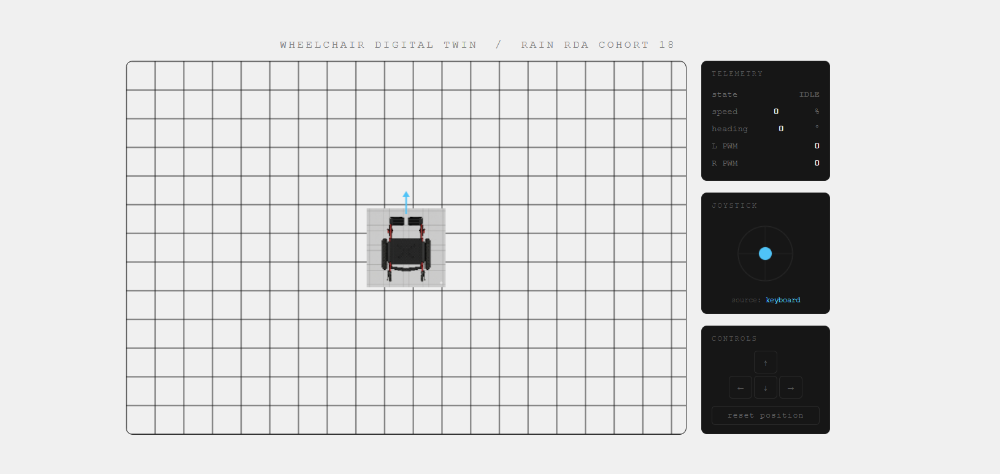

<p align="center">
  
</p>

<h1 align="center">🦽 Smart Assistive Wheelchair</h1>

<p align="center">
  <strong>Joystick-controlled motorized wheelchair with active fall detection</strong><br>
  Converting a manual wheelchair into an intelligent mobility aid — built at RAIN, Ibadan
</p>

<p align="center">
  
  
  
  
</p>

<p align="center">
  <a href="https://smart-wheelchair-twin.onrender.com"><strong>🖥️ Live Digital Twin Demo</strong></a> &nbsp;·&nbsp;
  <a href="https://www.linkedin.com/posts/salimat-akinwande_roboticsprojects-progress-learninginpublic-ugcPost-7461374283613745152-ERyA"><strong>📝 Project Story (LinkedIn)</strong></a> &nbsp;·&nbsp;
  <a href="https://salimahh.github.io"><strong>🌐 Portfolio</strong></a>
</p>

---

## 📌 What This Project Is

A standard manual wheelchair, converted into a **motorized, joystick-controlled assistive device** — with an onboard **MPU6050 gyroscope** that monitors tilt and triggers a local alarm if the user is at risk of tipping or falling.

The goal is simple: give people with motor impairments smooth, proportional control over their movement — without depending on a caregiver for every direction change.

This is a real hardware project. It has been welded, wired, re-welded, debugged, burned components, and rebuilt. The progress below reflects what actually happened.

---

## 🎯 Core Objectives

- ✅ Convert a manual wheelchair frame to motorized drive using BLDC hub motors
- ✅ Implement differential drive kinematics via Arduino Uno + analog joystick
- ✅ Simulate and validate full control logic in Proteus 8
- ✅ Build a browser-based Digital Twin that mirrors joystick input in real time
- 🔄 Complete physical bench test with dual motors + joystick (in progress)
- 🔲 Integrate MPU6050 fall detection on physical frame
- 🔲 Add GSM/IoT caregiver alert (future scope)

---

## 🏗️ System Architecture

```
┌─────────────┐     analog      ┌──────────────┐     PWM + DIR    ┌─────────────────┐
│  2-Axis     │ ──────────────► │  Arduino Uno │ ───────────────► │ ZS-X11H V2      │
│  Joystick   │                 │  (Brain)     │                   │ Motor Driver ×2 │
└─────────────┘                 └──────┬───────┘                   └────────┬────────┘
                                       │ I2C                                │ Phase wires
                                       ▼                                    ▼
                                ┌──────────────┐                   ┌─────────────────┐
                                │  MPU6050     │                   │  BLDC Hub       │
                                │  (Safety)    │                   │  Motors ×2      │
                                └──────────────┘                   └─────────────────┘
                                       │
                          tilt > 45° → PWM = 0 + ALARM
```

---

## ⚙️ Hardware Stack

| Component | Spec | Role |
|-----------|------|------|
| Arduino Uno | ATmega328P, 5V logic | Control brain |
| ZS-X11H V2 | 6V–60V BLDC driver | Motor control |
| BLDC Hub Motors ×2 | 3 phase + 5 Hall wires | Drive wheels |
| 36V Li-ion Battery | LT 1865-NL03, 4Ah, 144Wh | Power |
| 2-Axis Joystick | Analog 0–1023 | User input |
| MPU6050 IMU | 6-axis, I2C | Fall detection |
| Piezo Buzzer + LED | — | Local alarm |

---

## 💻 Software & Control Logic

### Differential Drive Kinematics

The wheelchair steers by running the two wheels at different speeds. Joystick X-axis controls rotation, Y-axis controls forward/reverse speed.

```cpp
// Map joystick to -255 → +255
int mapY = map(joyY, 0, 1023, -255, 255);
int mapX = map(joyX, 0, 1023, -255, 255);

// Deadzone — prevents idle drift
if (abs(mapY) < 20) mapY = 0;
if (abs(mapX) < 20) mapX = 0;

// Differential drive mixing
int leftSpeed  = constrain(mapY + mapX, -255, 255);
int rightSpeed = constrain(mapY - mapX, -255, 255);
```

### Safety Logic

```cpp
// MPU6050 emergency cutoff
if (abs(pitch) > 45 || abs(roll) > 45) {
  analogWrite(speedPinL, 0);
  analogWrite(speedPinR, 0);
  digitalWrite(buzzerPin, HIGH);
}
```

### Digital Twin (Browser-based)

A real-time 2D simulation that mirrors joystick input via serial → WebSocket → browser canvas.

```
Arduino (joystick) → Serial USB → Python/pyserial → WebSocket → index.html (Canvas)
```

**[→ Try the live demo](https://smart-wheelchair-twin.onrender.com)**

---

## 📁 Repository Structure

```
smart-assistive-wheelchair/
│
├── firmware/
│   └── wheelchair_main.ino       # Arduino sketch — joystick + motor + safety logic
│
├── digital-twin/
│   ├── index.html                # Browser simulation (2D Canvas)
│   ├── bridge.py                 # Python WebSocket bridge (serial → browser)
│   └── 2dWheelchairView.png      # Wheelchair top-down illustration
│
├── docs/
│   └── images/                   # Project photos (build progress, components, testing)
│
└── README.md
```

---

## 🔨 Build Progress

<table>
  <tr>
    <td align="center"><strong>Welding the motors to frame</strong></td>
    <td align="center"><strong>Fabricating the wheel mount</strong></td>
    <td align="center"><strong>Electronics & wiring</strong></td>
  </tr>
  <tr>
    <td></td>
    <td></td>
    <td></td>
  </tr>
  <tr>
    <td align="center"><strong>Component testing</strong></td>
    <td align="center"><strong>Presentation</strong></td>
    <td align="center"><strong>Digital Twin (live)</strong></td>
  </tr>
  <tr>
    <td></td>
    <td></td>
    <td></td>
  </tr>
</table>

---

## 🧱 Challenges & What I Learned

**Motor driver burnout**
Three ZS-X11H drivers were destroyed by a current spike from a shorted motor. Lesson: always test motors in open air with a fused line before connecting to the driver.

**Wheel height mismatch**
The motorized hub wheels were smaller than the front casters, causing the chair to tilt backward — a safety issue. Fixed by fabricating mounts that nested the hub motors inside the original wheels, restoring level ground clearance.

**Phase wire sequencing**
A motor vibrated but didn't spin — traced to an incorrect MA/MB/MC phase sequence and a broken Hall sensor wire. One wire out of five breaks the entire commutation cycle.

**Potentiometer override**
A new motor driver ignored Arduino PWM entirely because the onboard physical speed potentiometer had hardware priority over the VR pin. Had to zero it manually before Arduino control could take effect.

**Floating joystick pin**
Serial Monitor showed random values around 300 instead of stable 512 — a broken 5V jumper on the joystick. Continuity test first, always.

---

## 🚀 Running the Digital Twin Locally

**Requirements:** Python 3.x, Arduino IDE, Chrome

```bash
# Install Python dependencies
pip install pyserial websockets

# Upload firmware/wheelchair_main.ino to your Arduino

# Start the WebSocket bridge (update COM port if needed)
python digital-twin/bridge.py

# Open digital-twin/index.html in Chrome
```

Move the joystick — the wheelchair moves in the browser. Arrow keys work as fallback if no Arduino is connected.

---

## 🔭 Future Scope

| Feature | Description |
|---------|-------------|
| IoT caregiver alerts | SIM800L GSM module — SMS notification on fall detection |
| Live location tracking | GPS module + web dashboard for real-time wheelchair position |
| ROS/Gazebo Digital Twin | Full URDF model with real-time IMU + wheel RPM telemetry |
| Obstacle avoidance | Ultrasonic sensors with auto-brake |

---

## 👩🏾‍💻 Built By

**Salimat Oluwatobi Akinwande**
Electronic & Electrical Engineering (First Class), LAUTECH
Robotics Development & Automation Fellow — RAIN RDA Cohort 18, Ibadan

[Portfolio](https://salimahh.github.io) · [LinkedIn](https://www.linkedin.com/in/salimat-akinwande) · [GitHub](https://github.com/Salimahh)

---

*Built with real hardware, real failures, and real lessons — at [Robotics & Artificial Intelligence Nigeria (RAIN)](https://rainigeria.com), Ibadan.*
